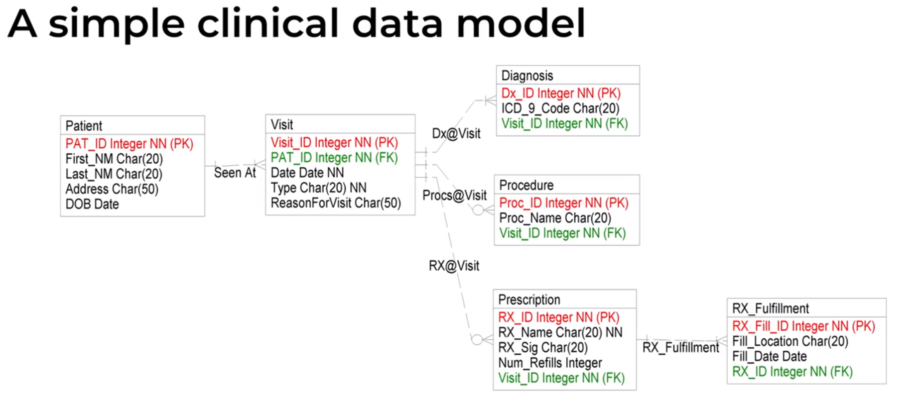
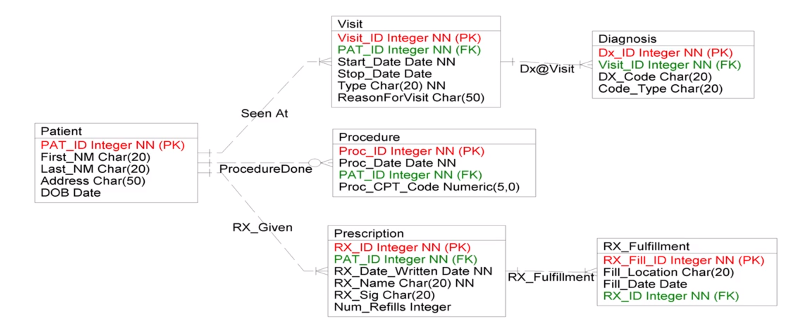
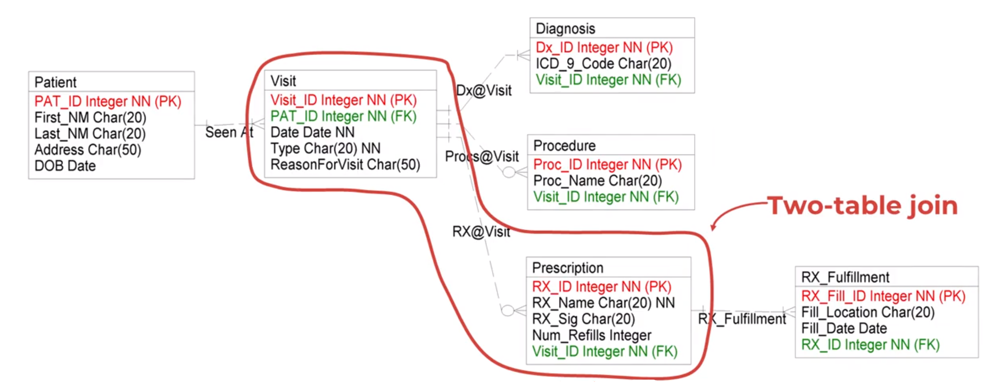
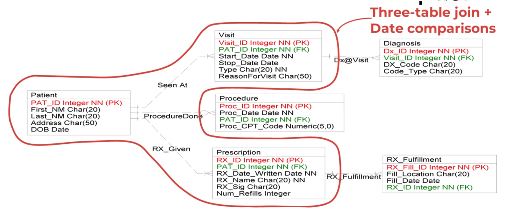
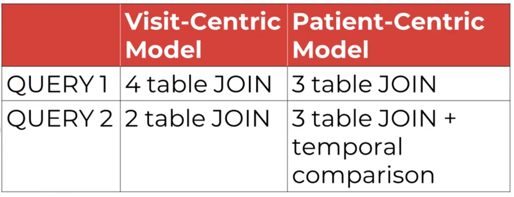

## Clinical Data Models

- For query 
>'For each pateint, how many medications were filled over a period of time'

The second model is better because only three tables need to be joined

- For query,
> What is the average number of prescriptions writeen per visit?

 

