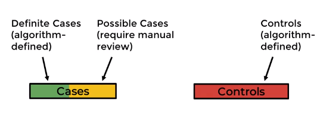
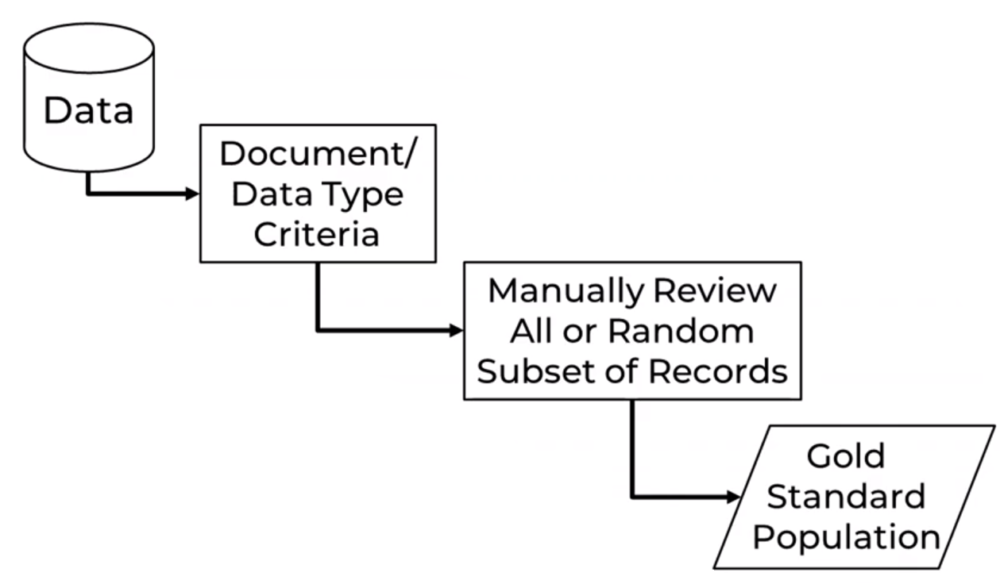
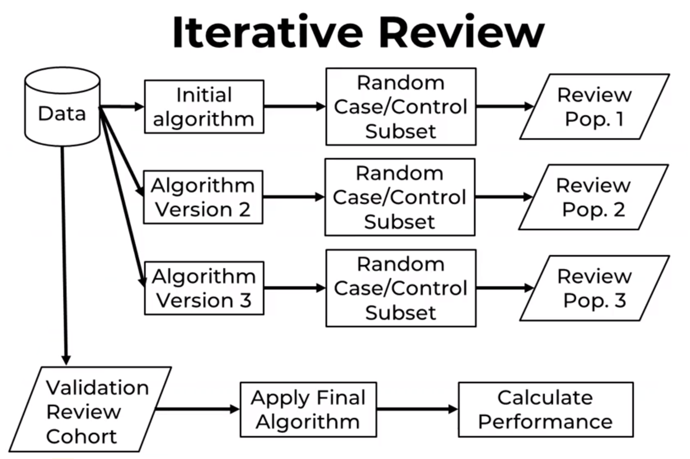

# Introduction to Computational Phenotyping

EHRs often contain the records of hundreds of thousands of patients. It's simply not efficient to read all the records individually to see what particular condition a patient has. Instead, we can create a Computational Phenotyping algorithm, an automated process to identify a population of interest.

## Computational Phenotyping
Computational Phenotyping was developed as a method for identifying patient populations for scientific studies. As such, it typically is focused on identifying two populations: cases and controls.

Typically, these algorithms can identify definite cases and controls shown here in green and red. There may be some records that may need parts of the algorithm defining cases. These records could be manually reviewed to determine whether or not they are true cases. Other records are excluded from a particular analysis because they may have a similar condition or the record may not have enough information to know whether they are case or control.

Typically evaluate the performance of phenotyping algorithms by manually reviewing patient records to determine the true status of the patient and whether or not they have the condition. In most cases of Computational Phenotyping, we validate the performance of the algorithm with a smaller subset of patients, say 1-200 records. Then once the algorithm has been validated, we can apply it to the total study population.

## Manual Record Review

The most important step in identifying patient populations is manually reviewing patient medical records to identify your gold standard population. A **gold standard population is a set of records that you have manually reviewed to determine the truth about whether they have the condition of interest**. Based on this review, you can determine how accurate your algorithms are at correctly classifying this patients with and without the condition. This step determines what population you are actually identifying. Clearly defining the population you used in your gold standard is crucial to understanding the validity and utility of all the downstream analyses you do in this population.

Example: Diabetes

* What kind of diabetes?
  - Type one
  - Type two
  - Monogenic diabetes, a subtype distinct from types one and two.
* What level of evidence?
  - Any mention in the EHR of having been diagnosed with diabetes?
    - What if that is patient self-reported medical history at a single emergency room visit
  - have been diagnosed or treated by an endocrinologist or primary care provider
  - a laboratory measurement indicating diabetes
  - there are more subtle indications that the patient has a disease like receiving a diabetes treatment without a diagnosis listed
  - OR only accept patients who meet the clinical criteria for diagnosis set by the American Diabetes Association, but which guideline year should you use

There are many options.... so look at analytic goal.

* If you were in a research environment, looking at genetic risk factors for diabetes, it may make sense to limit your population to those with laboratory evidence, so you get a more homogenous if smaller population.

* if you are looking to build a clinical prediction model for the diabetic patients at your medical center, you may want to use criteria that are structured and widely available in the EHR, so that you can more easily deploy your model in the clinic.

Then who is going to perform manual review?

 In general, if you are simply verifying the presence of a diagnosis made by a health care provider, then anyone on your data science team should be qualified to perform the manual review. However, if you are reviewing the EHR data to identify a new medical finding that the patient's care team may not have already diagnosed, your reviewers need to have significant expertise. This type of review is essentially retrospectively diagnosed in a patient. As such, these reviewers should have medical training such as: a physician, pharmacist or other advanced practice provider as appropriate for your population of interest.

|Review Type|Expertise|How Many|
| -----------                                        | ---------                       | --------                  |
| Simple Review (e.g. verfigying existing diagnosis) | Limited Medical Knowledge is OK | One may be OK, two better |
| Complex (e.g. identify new diagnosis)              | Advanced Medical Training       | Two minimum               |

## Handling Reviewer Disagreements
If you have multiple reviewers for each record, it is possible that the reviewers may disagree on the classification of the record. For example reviewer A believes the record is the case, and reviewer B classified them as a control. There are few methods you can apply to correct the dispute:

* Joint Review - This method has both reviewers discuss the record and come to a consensus. This approach is helpful because it may identify a part of the record one reviewer missed, or, more importantly, it may clarify an underlying difference in interpretation of the phenotype.
* Third Reviewer - A third reviewer may be brought in to act as tie-breaker and make the final classification of the record. Typically this is the senior or most experienced record review team member.
* "Expert Reviewer Designation" - If there isn't a third person for review and consensus can't be reached, one of the reviewers may be classified as the "expert" and their classification is final. This is common in cases where the reviewers have different levels of expertise, for example, if one reviewer is an attending physician and the other is fellow, the attending’s classification may automatically be accepted.

There are two schools of thought in this process.

1. **Gold Standard approach**

  In some fields like **natural language processing**, typically create a gold standard population. In this process, there may be some document or data type criteria. For example, examining only discharge summary notes. The review then may occur on all documents of that type or on a random subset of those records. These assignments then create a single gold standard population. This population is the starting point of all future analysis. It may be separated into training and testing sub-groups, but the review, all happen at one time.
  

2. **Iterative Review**

  In computational phenotyping field on the other hand, typically use a more iterative approach. In this case, the data scientists typically create a prototype at their algorithm. Randomly select a subset of records that the algorithm classified as cases or controls. Then reviews those records to see how well the algorithm performed. Based on this review, they then tweak the algorithm adding or removing criteria and then selecting a second random subset of records. This continues on until they reach satisfactory performance of their algorithm. Importantly, a final validation cohort of completely randomly selected records must be performed to get accurate information on how well the final algorithm performs.
  

## Comparing these Methods
Both approaches have their benefits and potential drawbacks. The gold-standard approach is convenient because the manual record review happens all at one time, whereas the iterative approach may require longer periods of reviewer engagement. That said, when performing computational phenotyping the iterative review process is typically more efficient as there are almost an infinite number of possible algorithms you could apply to a gold-standard population, but this approach stops once an algorithm of sufficient quality is identified.

  The iterative review process is typically more efficient as there are almost an infinite number of possible algorithms you could apply to a gold standard population.

## Potential statistical issues
Both gold standard and iterative review have potential statistical issues.

When using a gold standard population, it is very easy to over-fit your data. Which means that you develop algorithms that work very well in the reviewed cohort, but does not perform well on other patient records. You can avoid this over fitting by separating the gold standard population into training and testing populations.

With the iterative approach, if you fail to review a validation cohort of randomly selected records, your estimates of how well the algorithm works may be biased and look more accurate than it really is. This is because the iterative approach reviews records based on the algorithm classification which will overestimate the performance of the algorithm. Only the algorithm performance from a randomly selected validation cohort will provide generalizable performance statistics.

## Tools and Techniques
There are three main methods for performing manual record review.

### Creating a review instrument
like a listing of patient records
use REDCap rather than Excel to enter some records
### Developing a review protocol
This protocol will outline how you expect the manual review to be conducted so that the review is consistent across all reviewers and all records.
### Assessing the quality of your manual review
When you have more than one reviewer, you need to calculate the inter-rater agreement or kappa statistic to determine the quality of the review. The kappa statistic measures how consistent the two reviewers were in their review.

$k=\frac{\text{P_observed-Pexpected}}{1-Pexpected}$

 If the reviews do not have a high concordance rate, then the results of the review are in question, and a new method of review must be performed.

The kappa statistic compares the proportion of observed agreement with the proportion of expected agreement if the values were randomly assigned. For example:

| -             | Reviewer1 Yes | Reviewer2 no |
| ------------- | ------------- | ------------- |
| Reviewer2 Yes | A             | B             |
|Reviewer2 No |    C           |  D             |

Observed proportion of agreement is
$P_o = \frac{A+B}{A+B+C+D}$

The expected proportion of agreement

$P_{yes} = \frac{A+B}{A+B+C+D} \times \frac{A+C}{A+B+C+D}$

$P_{no} = \frac{C+D}{A+B+C+D} \times \frac{B+D}{A+B+C+D}$

$P_e=P_{yes} + P_{no}$

## Example

###  Phenotype of Interest
Each programming example in this course will work through developing a computational phenotyping algorithm for type II diabetes.

### Manual Record Review Example
####Review Instrument
This manual record review was fairly simple - just two questions - what was the record identifier and did they have type II diabetes or not.

|Variable|	Entry Type|
|--|--|
|SUBJECT_ID|	[numeric]|
|Diabetes|	Yes/No|

### Review Protocol
1. Check if diabetes listed in the "Past Medical History" section of the "Discharge Summary" note. If Yes - enter "Yes" into the instrument, if not - continue.
2. Search all note types for "diab" and review for terms like "diabetes" or "diabetic". If indicated, enter "Yes" into the instrument, if not - continue.
3. Search all note types for "t2d" (this is a common abbreviation for type II diabetes). If indicated, enter "Yes" into the instrument, if not - continue.
4. Search all note types for "dm" (this is a common abbreviation for diabetes mellitus). If indicated, enter "Yes" into the instrument, if not - continue.
5. Conclude that the patient record does not have any indication that the patient has diabetes, enter "No" into the instrument. Review of this record is complete.
