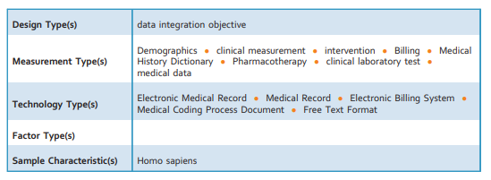
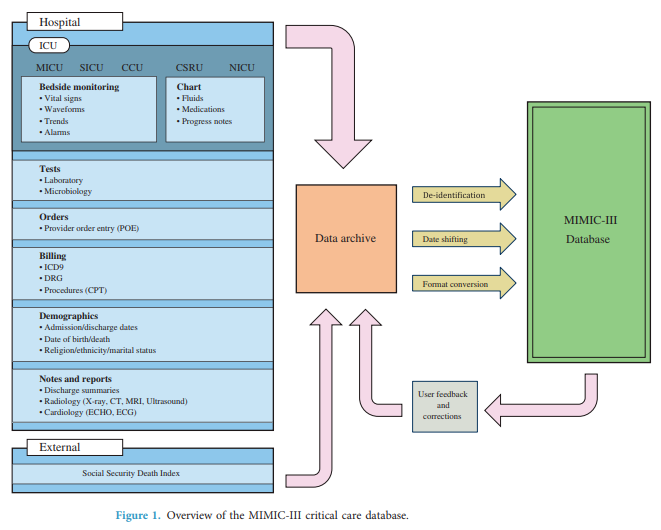
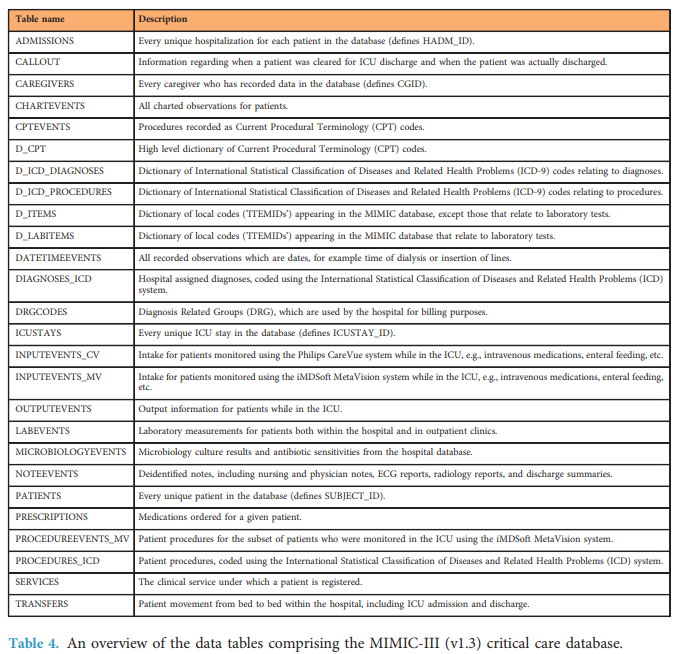

# Introduction to the MIMIC-III Data Set

## MIMIC-III
Johnson et.al. Data Descriptor: MIMIC-III, a freely accessible critical care database (2016)

Medical Information Mart for Intensive Care

- De-identified health data
- Over 40,000 patients treated in critical care at Beth Israel Deaconess Medical Center






## SQL Examples

```SQL
-- Querying MIMIC(C2M2V2)
-- How many patients
select count(distinct subject_id) as NUM_PTs
from `mimic3_demo.PATIENTS`

--How many admissions
select count(distinct hadm_id) as NUM_ADMISSIONS
from `mimic3_demo.ADMISSIONS`

-- Counts of diagnoses by patients NO LABELS
select ICD9_CODE, count(distinct SUBJECT_ID) as CNT_DX
from `mimic3_demo.DIAGNOSES_ICD`
group by ICD9_CODE
order by count(distinct SUBJECT_ID) desc


--Counts of diagnoses by patients WITH LABELS
select dx.ICD9_CODE, ddx.SHORT_TITLE,
       count(distinct dx.SUBJECT_ID) as CNT_DX
from `mimic3_demo.DIAGNOSES_ICD`  dx
    JOIN `mimic3_demo.D_ICD_DIAGNOSES` ddx using (ICD9_CODE)
group by dx.ICD9_CODE, ddx.SHORT_TITLE
order by count(distinct dx.SUBJECT_ID) desc

-- Number of drugs per patient per admission
select SUBJECT_ID, HADM_ID,
       count(DISTINCT DRUG) as CNT_DRUG
from `mimic3_demo.PRESCRIPTIONS`
GROUP BY SUBJECT_ID, HADM_ID
order by count(DISTINCT DRUG) desc

-- Average number of drugs across all admissions
select avg(CNT_DRUG) as AVG_DRUG_CNT
FROM
   (select SUBJECT_ID, HADM_ID,
       count(DISTINCT DRUG) as CNT_DRUG
       from `mimic3_demo.PRESCRIPTIONS`
       GROUP BY SUBJECT_ID, HADM_ID)


-- Querying OMOP (C2M2V4)
-- How many patients
select count(distinct person_id) as NUM_PTs
from mimic3_demo_omop_c.person

-- How many admissions
select count(distinct visit_occurrence_id) as NUM_ADMISSIONS
from mimic3_demo_omop_c.visit_occurrence

--Count of diagnoses by patients
select condition_concept_id, count(distinct person_id) as NUM_DX
from mimic3_demo_omop_c.condition_occurrence
group by condition_concept_id
order by count(distinct person_id) desc

--Count of diagnoses by patients with labels
select condition_concept_id, c1.concept_name, count(distinct person_id) as NUM_DX
from mimic3_demo_omop_c.condition_occurrence co JOIN
     mimic3_demo_omop_c.concept c1 on (co.condition_concept_id = c1.concept_id)
group by condition_concept_id, c1.concept_name
order by count(distinct person_id) desc

--Number of drugs per patient per admission
select person_id, visit_occurrence_id, count(distinct drug_concept_id) as NUM_DRUG
from mimic3_demo_omop_c.drug_exposure
group by person_id, visit_occurrence_id
order by NUM_DRUG desc

-- Average number of drugs across all admissions
select avg(NUM_DRUG) as AVG_NUM_DRUGS
from (select person_id, visit_occurrence_id,
            count(distinct drug_concept_id) as NUM_DRUG
      from mimic3_demo_omop_c.drug_exposure
      group by person_id, visit_occurrence_id)
```

## Identifiers

**SUBJECT_ID** - Patient

**HADM_ID** - hospital admission


## Hospital Stay Data
**ADMISSIONS** - unique hospitalizations

**ICDSTAYS** - unique ICU stays

**PATIENT** - unique patients in data

**CALLOUT** - movement from ICU

**TRANSFERS** - movement in hospital

## Critical Care Unit Data
**CAREGIVERS** - unique caregivers

**CHARTEVENTS** - all observations

**DATETIMEEVENTS** - all date observations

**NOTEEVENTS** - clinical notes

**INPUTEVENTS_CV** - fluid intake in CV

**INPUTEVENTS_MV** - fluid intake in MV

**PROCEDUREEVENTS_MV** - procedures in MV

**OUTPUTEVENTS** - fluids excreted

## Hospital System Data
**CPTEVENTS** - billing

**DIAGNOSES_ICD** - billing

**PROCEDURES_ICD** - billing

**DRGCODES** - billing

**LABEVENTS** - laboratory data

**MICROBIOLOGYEVENTS** - laboratory data

**PRESCRIPTIONS** - medications

## Dictionary Tables
**D_CPT**

**D_ICD_DIAGNOSES**

**D_ICD_PROCEDURES**

**D_ITEMS**

**D_LABITEMS**
