# [OMOP](https://www.ohdsi.org/)
The OMOP Common Data Model documentation and a wide-range of freely available open source tools that support creating and using the data model, are available via the OHDSI homepage under the resources tab or across the top banner. A very active user community posts questions and answers on the OHDSI forums. Detailed documentation of the OHDSI CDM and the tools are posted in the Wiki, and all software is found in the OHDSI GitHub site. Tutorials and presentations by community members, are also available under the Resources tab. There are SQL create table DDLs statements for many database management systems including Google BigQuery, available on the OHDSI CDM GitHub site.

## [OMOP Common Data Model](https://www.ohdsi.org/data-standardization/the-common-data-model/)
Below figure is a conceptual view of the OMOP CDM, which has tables that can be divided into different broad categories that are distinguished here by different background colors. For example, the blue background groups OMOP tables that focus on storing clinical data. Whereas the tables in light green, focus on storing healthcare cost data. On the far right, in orange color, are a large number of tables focused on standard terminologies, which is a key differentiator of the OMOP CDM from other research common data models. Understanding how OMOP leverages these terminologies tables, is critical to taking full advantage of the International Data Network for large scale data sharing.
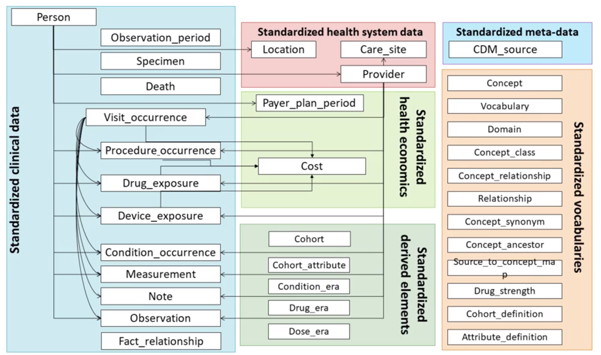
OMOP can be considered as two models that are merged together. OMOP uses the terms source and standard, to distinguish these two views of the CDM data.
On the source side of the OMOP model, OMOP stores the original data value as it exists in the originating data source. On the source side of the model, are columns that begin with the word source. The two key fields or source value and source concept ID. These fields are used to store data variables in their native or local format, prior to any mapping into a standard format or standard code. These fields begin with the word concept underscore, and hold the terms from the OHDSI terminology that are explicitly identified as S for standard. Source terms must be mapped to the standard terms. Queries executed using these terms, can be used across multiple OHDSI databases. In addition, all of the OHDSI tools use fields, that use the standard terms. The OHDSI community consists of data partners across diverse clinical and administrative settings in different countries. The power of using standard terms as described earlier, is that different data sources can map their terms into a single common standard term. Once this mapping has occurred, OMOP also provides term hierarchies, called classification terms. The law queries that refer to groups of related terms using a single higher level parent term. OHDSI supports multiple different classifications to group different sets of standard terms, as we will see a little later.
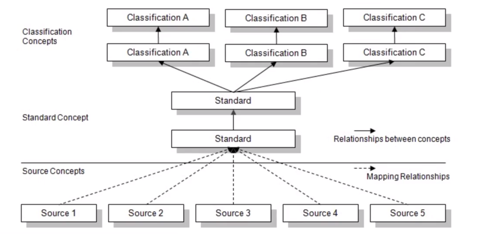
Here, we see source terms for different forms of atrial fibrillation, which is one of the many types of abnormal heart rhythms. Using OHDSIs classification terms, we see progressively more general terms that group together specific forms of atrial fibrillation into more general term atrial fibrillation. This diagram shows progressively higher forms of abnormal heart rhythms, which would bring in more lower level terms for other types of heart rhythms. OMOP terminology tables provide support for these type of parent, child queries. This is an example of one of OHDSI term hierarchies.

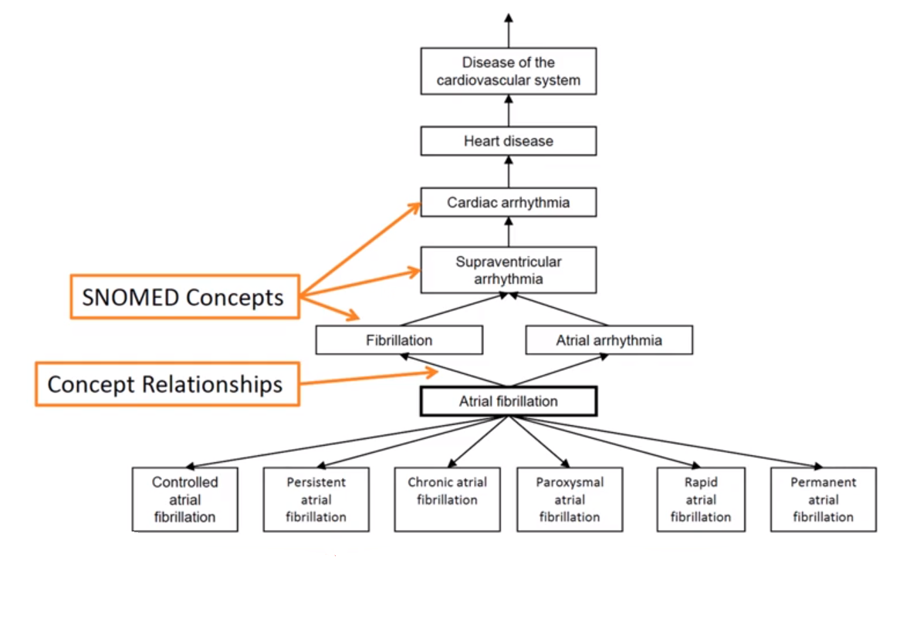
This hierarchy is for disease diagnosis. At the bottom, are various local terminologies. Some are used only in the United States, other are used in the United Kingdom, and others are used internationally across countries. All of these local terms, are mapped to OMOPs standard terminology for all diseases. In this case, OHDSI uses SNOMED-CT for its standard terms. SNOMED-CT, is a very large international terminology standard that is widely used in clinical practice and clinical research. SNOMED-CT has multiple hierarchies of more general terms, which can be used to perform queries. However, many institutions and especially the US FDA, uses a disease hierarchy called MedDRA. OHDSI provides mappings between MedDRA and the standard SNOMED-CT terms. This feature allows users who are more comfortable with using MedDRA disease hierarchy, to use those terms in their queries and leverage the OHDSI supplied mappings, to obtain the standardized SNOMED-CT terms for queries.
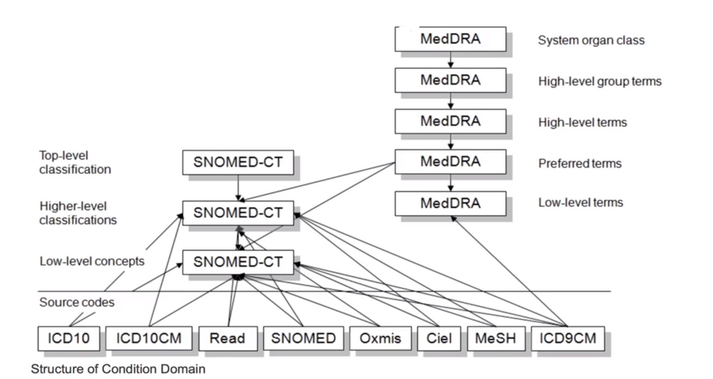
This is a second example of OHDSIs concept hierarchy for clinical procedures. At the bottom, are various local terminologies, all of which are mapped again to SNOMED-CT. The local side of the OMOP Data model, keeps the original terms from the bottom of this hierarchy. Then, network side of the OMOP Data Model harmonizes all of those into common SNOMED-CT terms, that are used by everybody who implements the OMOP Data Model.
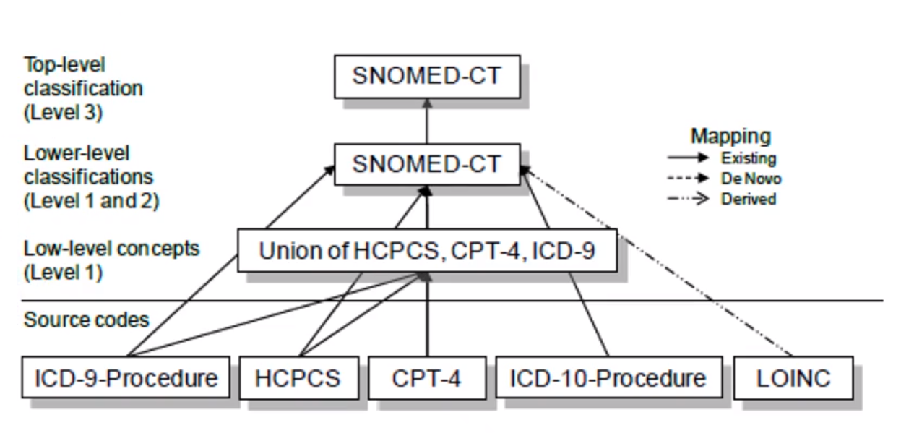
The power of having multiple terminology hierarchies available for queries is shown here. At the bottom of various forms of a medication called Lisinopril, in various dosages. All of these medication contain lisinopril as a common ingredient. As I will show you, OMOP provides multiple drug hierarchies. But here, I am showing only two different hierarchies. One that combines different medications by a common indication, and another that combines different medications by a common mechanism of action called drug class. Lisinopril is one of many medications that is used to treat hypertension or elevated blood pressure. There are other types of medication that are also used for this disease indication. Similarly, lisinopril is a member of a class of drugs called ACE inhibitors. There are other drugs in this drug class. Using OMOPs terminology tables, one can construct a query for all medications that are used to treat hypertension. Or, a query for all medications that are ACE inhibitors, or just a query for medications that contain lisinopril as an ingredient, or very specific formalized lisinopril such as five milligram oral tablets.
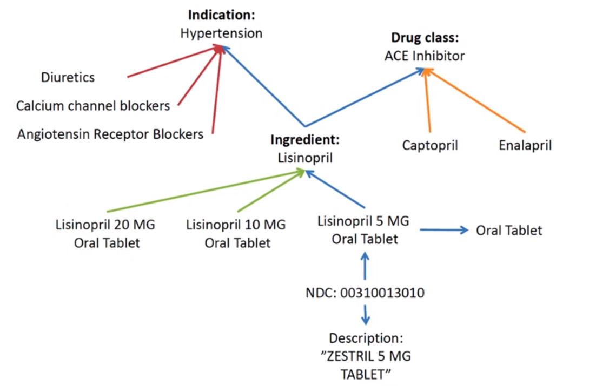
Underscoring almost beginnings to support worldwide surveillance, OMOP has extensive terminologies for drugs from the United States and other countries worldwide. The standard medication terminology used by OMOP, is an open source terminology called RxNorm, which is provided by the National Library of Medicine in the United States. There is a wide range of drug hierarchies available in OMOP. We will use the NDFRT drug hierarchy in our queries. NDFRT which stands for the National Drug File Reference Terminology, is produced and supported by the US Department of Veterans Affairs. It is an open source drug terminology that provides multiple different drug hierarchies. In OMOP, we use the NDFRT therapeutic class hierarchy, which organizes drugs according to the diseases that they are used to treat. I have spent a substantial amount of time in this video on OMOP terminologies and hierarchies, because this is a highly distinguishing feature of OMOP. It is one of the more complex features of OMOP to understand and utilize.
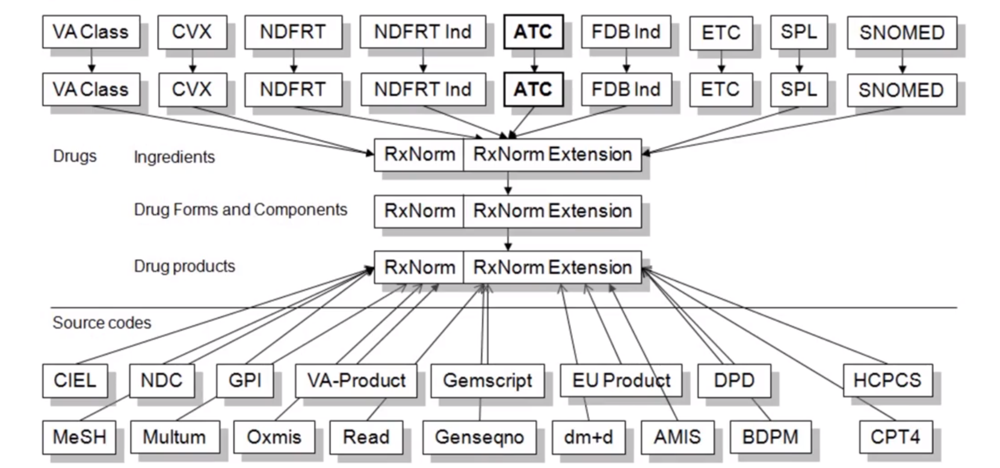
## Benefit of using OMOP
A benefit of the OMOP terminology environment, is that it maintains mappings for more widely used local terminologies to its standard terminology. For example, ICD10-CM is a diagnosis terminology widely used in the United States, but not in other countries. OMOP provides mappings from ICD10-CM into the standard SNOMED-CT terms, that can be used on the network side of the Data Model. As we have seen, OMOP also maintains all of the concept hierarchies. If new children terms are released such as a new medication being released into the market, OHDSI adds that new term to the standard terminology and also adds that term to the appropriate higher-level classification terms in the relevant hierarchies. Queries which refer to higher-level of classification term, will automatically include the new child term in future queries. As we illustrated, with SNOMED-CT and MedDRA, and the clinical indication drug class examples, the OMOP terminology support multiple hierarchies. So, an end user can form queries that use terms that are familiar to their setting. This information won't be readable in this video, but it is available in the course readings. It shows the vast array of OHDSI terminologies. This list contains 35 terminologies maintained by OHDSI. Here, are the remaining terminology up to terminology number 85. OHDSI continues to expand the terminology list, so the current list is likely to be even larger. Remember, that you can find this information in the course readings. Let's summarize the key points regarding the OMOP Common Data Model. Columns label with SOURCE_VALUE, hold values that were present in the original data source prior to any data reformatting or terminology mapping. Columns labeled CONCEPT_ID, stored OMOP defined standard terms, only these terms are the same across all data partners irrespective of the original data source, clinical setting or country. Finally, concept hierarchies are one of OMOPs most powerful features, but are only available for standard terms on the network side of the model and not local terms on the local side of the model. Terminology hierarchies, allow for queries to be specified using higher level of generalization or abstraction, than enumerating large sets of individual lower level child terms.

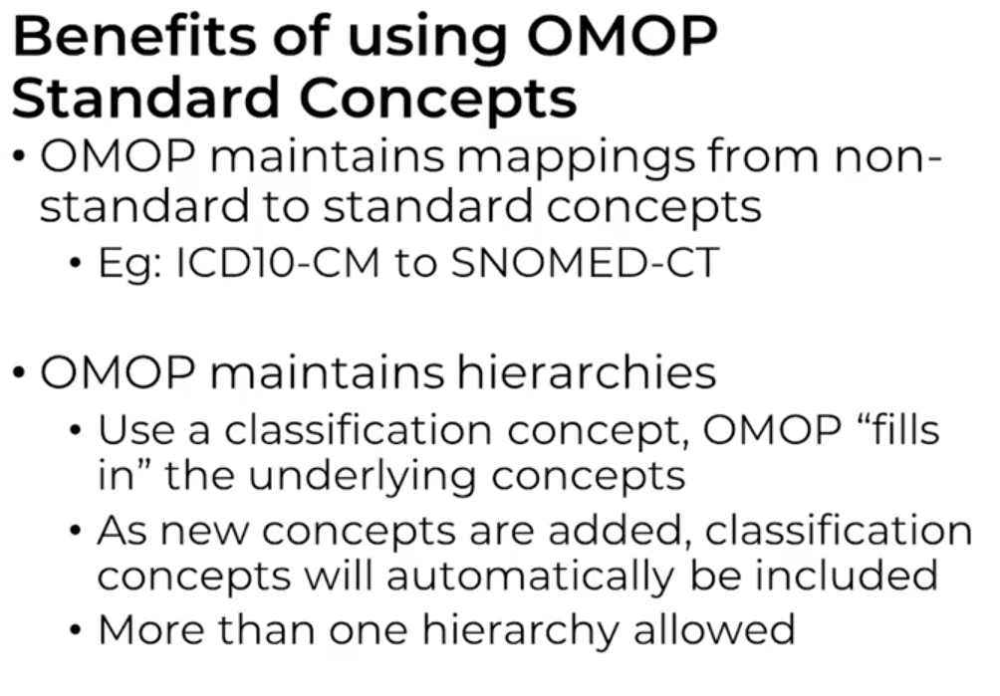
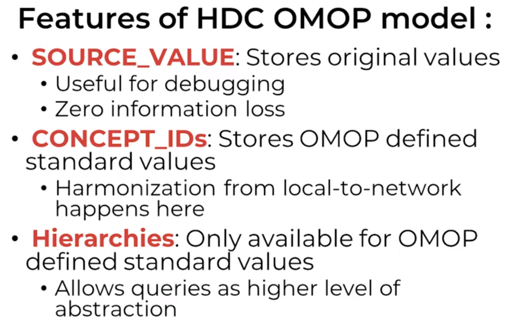

## Querying OMOP

### Standard Variable Names
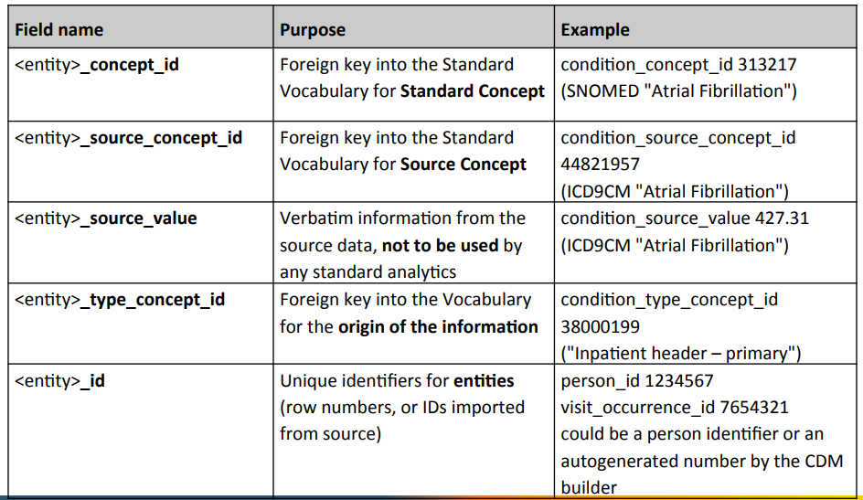
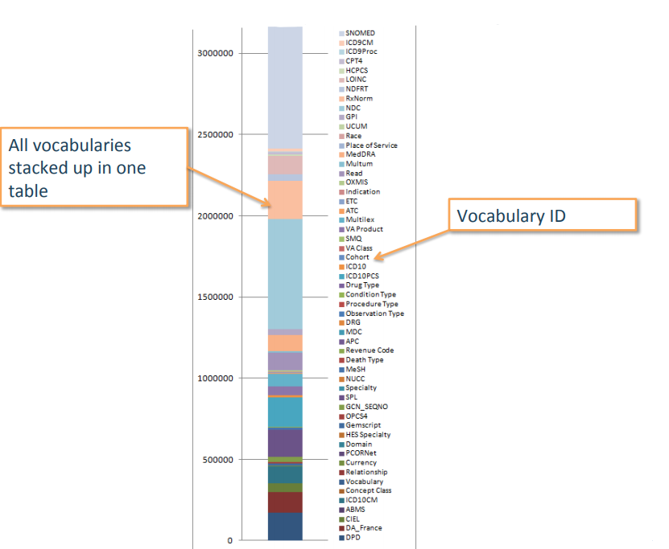
### What's in concept?
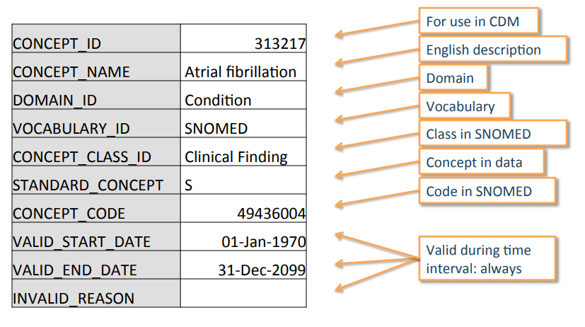
### OMOP	CDM	Standard	Domain	Features
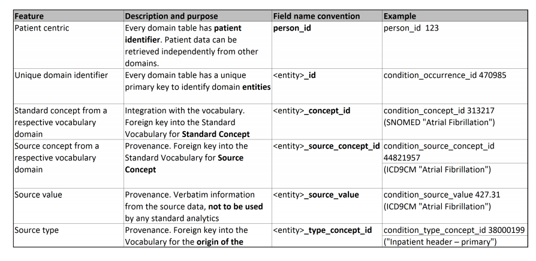
### Integration	of	CDM	and	Vocabulary
http://athena.ohdsi.org/search-terms/terms

Concepts	are	referred	to	by	concept_id.
All	details	are	in	the	CONCEPT table:
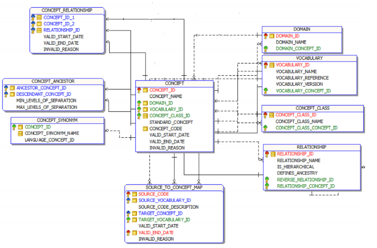
1. All	content:	concepts	in	`concept`	table
2. Direct	relationships	between	concepts	listed	in	`concept_relationship`
3. Multi-step	hierarchical	relationships	pre-processed	in	`concept_ancestor`
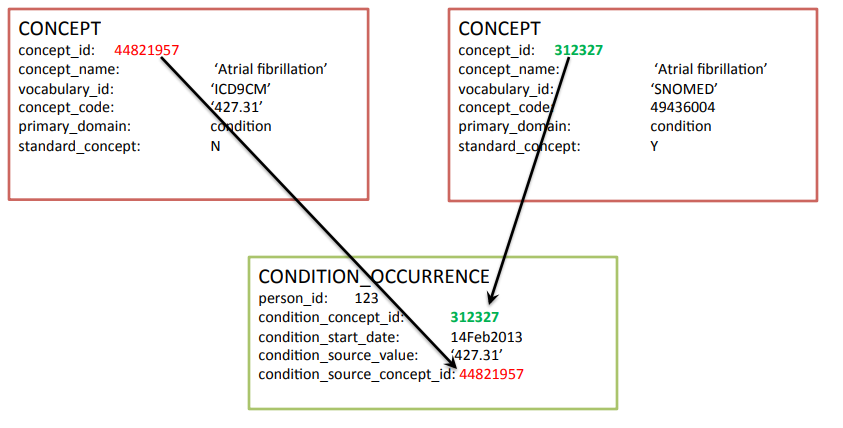
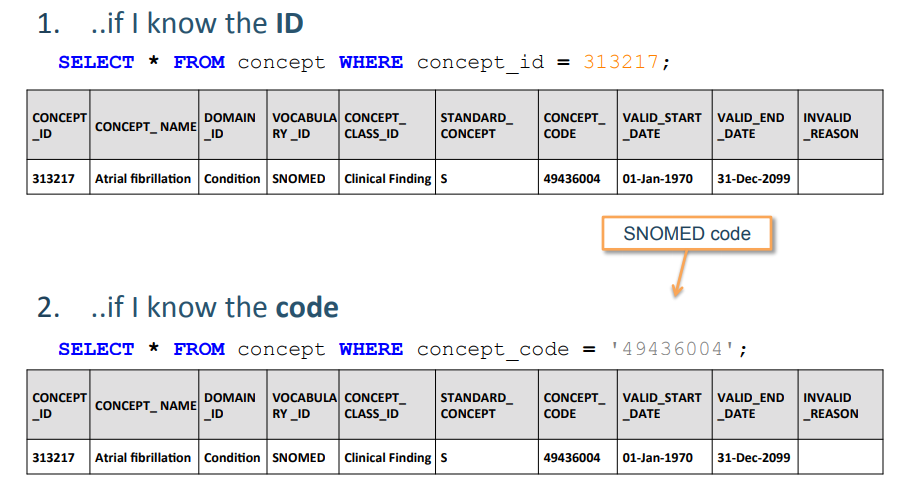
### Concept	ID	versus	Concept	Code

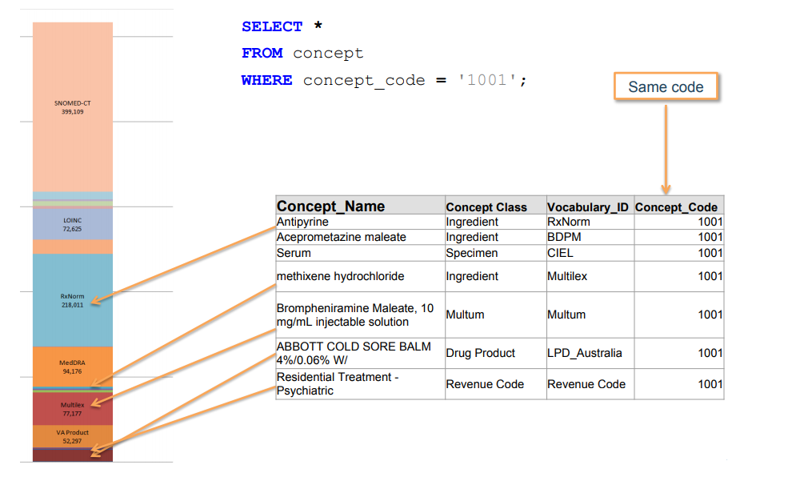
### Finding	the	Right	Concept
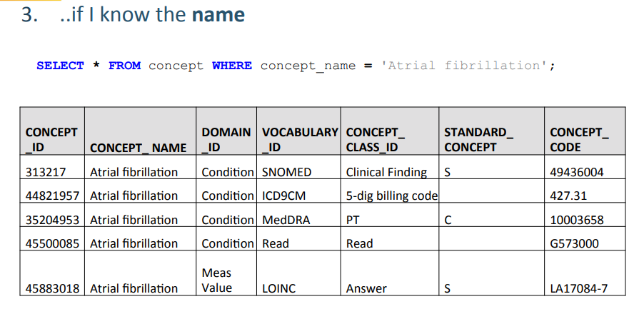
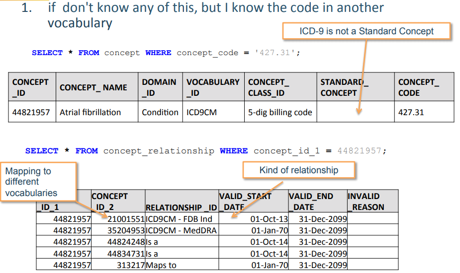
